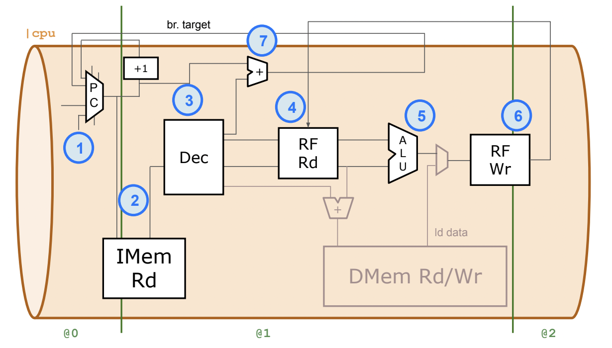
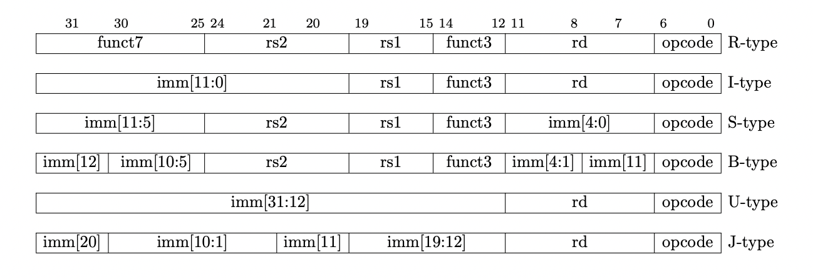
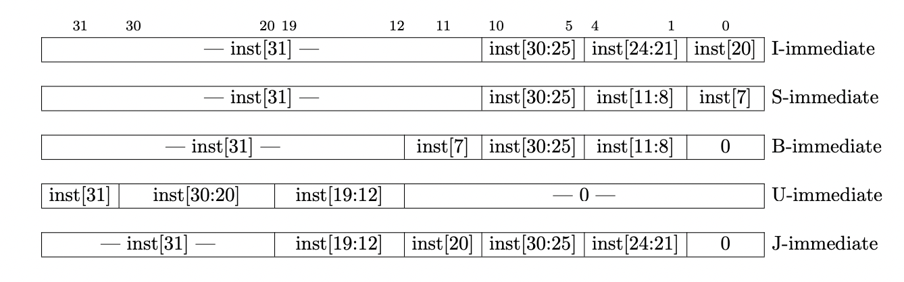
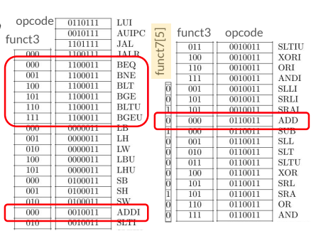
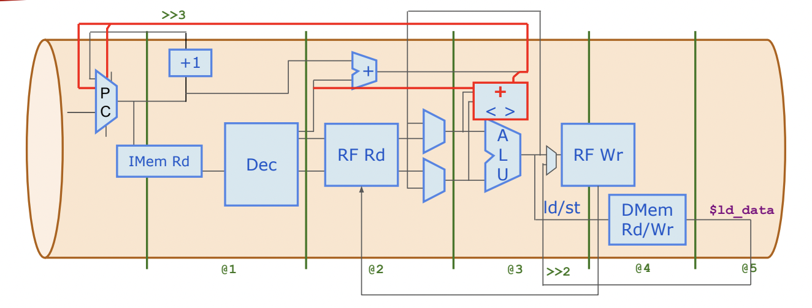
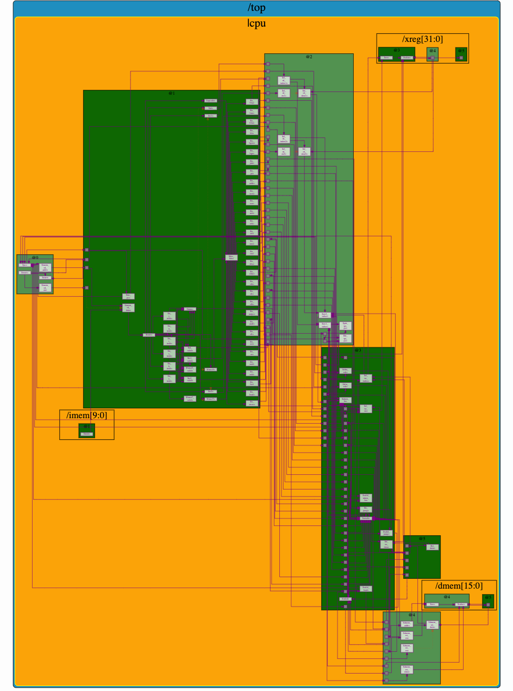

# RISC-V core named MYTH from RISC-V MYTH Workshop
RISC-V is an open standard instruction set architecture(ISA) based on reduced instruction set computer(RISC) principles. It consists of a base integer(32-bit) instruction set called RV32I.
There are 31 general-purpose registers `x1-x31`, which holds integer values. Register x0 is hardwired to constant `0`. The `x` registers are 32 bits wide for RV32 and 64 bits wide for RV64. The RISC-V instruction set manual refers the width of `x` register in bits as XLEN.

This design is a RISC-V core that supports RV32I base integer instruction set except FENCE, ECALL, EBREAK implemented in [TL-Verilog](https://www.redwoodeda.com/tl-verilog).

## What is TL-Verilog
TL-Verilog is a high level transaction level verilog specification that is simpler to implement the design at transaction level and allows pipelining the design conveniently. The design can be compiled and visualized in [Makerchip](https://makerchip.com) platform.

## Introduction to MYTH micro-architecture
The schematic of the MYTH core design (unpipelined) is shown below
 

We include a sample test program i.e., sum of numbers from 1 to 9 to test the design, which is included in the design file.
### Fetch
The instruction memory(imem) is 32-bit wide and the test program is stored in the instruction memory. The program counter(PC) is 32-bit wide and reads the instruction from the memory every clock cycle.

### Decode
The instruction read from the instruction memory is decoded in this stage. The instruction type, source and destination register address and other fields in the instruction are decoded as represented in the below instruction specification.
The instructions are broadly grouped as:
- R-type : register-register
- I-type : short immediates and loads
- S-type : stores
- B-type : conditional branches
- U-type : long immediate
- J-type : unconditional jumps

  

  

  

### Register File read
The address of the registers obtained from the decode stage is used to read values of the source registers from the register file. This operands are passed to the Execute Unit to perform the operation specific to the instruction. The result computed in the execute stage is fed back as an input to the execute stage along with the register operands through bypass muxes to address the Read after Write(RAW) hazard.

### Execute
The source and/or immediate operands obtained from the register file read are used to perform various logical and arithmetic operations based on the opcode of the instruction. The results of the computation are written back to the register file in case of R-type instructions and written to Data memory(dmem) in case of store instruction. Data is read from the Data Memory in case of load instruction. The design currently supports loads and stores at Word level only.

### Register File write
The result of the computation from the execute stage is written back to the register file based on the address of the destination register in the instruction, depending on the instruction type.
### Data memory read/write back
The address computed in the execute stage is used to load/store the data from/to the Data memory in this stage.

The pipelined version of the core is shown below:

  

The schematic diagram of the core implemented in [Makerchip](https://makerchip.com) platform is shown below

  

The source code of the design is available under the path ```hardware/src```
